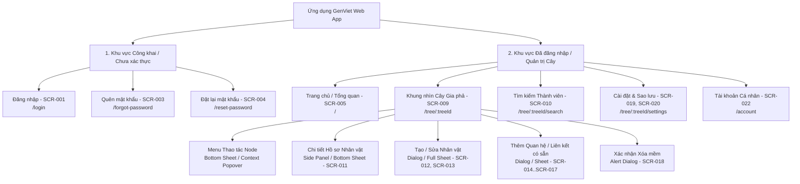

# Sơ đồ Cấu trúc Trang & Kiến trúc Thông tin (Sitemap v0.1)

- **Mã tài liệu:** `UX-SITEMAP-01`
- **Phiên bản:** `v0.1-baseline`
- **Trạng thái:** `PROVISIONAL`
- **Ngày ban hành:** 2026-08-29

---

## 1. Sơ đồ Kiến trúc Điều hướng Toàn cục (Global Sitemap Architecture)

---

## 2. Bảng Phân loại Cấu trúc Điều hướng theo Cấp độ và Quyền hạn

| Mã Node Sitemap | Tên Màn hình / Lớp giao diện | Đường dẫn Khái niệm | Vùng | Yêu cầu Đăng nhập? | Mức độ Ưu tiên MoSCoW | Loại Hình Hiển thị |
| :--- | :--- | :--- | :---: | :---: | :---: | :--- |
| **`SITE-001`** | Trang Đăng nhập | `/login` | Public | ❌ Không | `MUST` | Full Page |
| **`SITE-002`** | Trang Quên Mật khẩu | `/forgot-password` | Public | ❌ Không | `MUST` | Full Page |
| **`SITE-003`** | Trang Đặt lại Mật khẩu | `/reset-password` | Public | ❌ Không | `MUST` | Full Page |
| **`SITE-004`** | Dashboard / Tổng quan Cây | `/` hoặc `/dashboard` | Auth | ✅ Bắt buộc | `MUST` | Full Page |
| **`SITE-005`** | Tạo Cây Gia phả Mới | `/trees/new` | Auth | ✅ Bắt buộc | `MUST` | Modal Dialog / Page |
| **`SITE-006`** | Khởi tạo Người Đầu Tiên | `/trees/:id/initial` | Auth | ✅ Bắt buộc | `MUST` | Guided Onboarding / Dialog |
| **`SITE-007`** | Canvas Cây Gia phả (Chính) | `/trees/:id` | Auth | ✅ Bắt buộc | `MUST` | Interactive Full Viewport Canvas |
| **`SITE-008`** | Chi tiết Hồ sơ Thành viên | *(Overlay)* | Auth | ✅ Bắt buộc | `MUST` | Desktop: Side Panel / Mobile: Bottom Sheet |
| **`SITE-009`** | Form Thêm / Sửa Thành viên | *(Overlay)* | Auth | ✅ Bắt buộc | `MUST` | Desktop: Dialog / Mobile: Full-screen Sheet |
| **`SITE-010`** | Tìm kiếm Nhanh Thành viên | *(Overlay)* | Auth | ✅ Bắt buộc | `MUST` | Command Bar / Search Modal |
| **`SITE-011`** | Xem trước & Cảnh báo Quan hệ | *(Overlay)* | Auth | ✅ Bắt buộc | `MUST` | Sub-modal / Inline Warning Card |
| **`SITE-012`** | Hộp thoại Xác nhận Thao tác Nguy hiểm | *(Overlay)* | Auth | ✅ Bắt buộc | `MUST` | Alert Dialog |
| **`SITE-013`** | Cài đặt & Xuất Sao lưu JSON | `/trees/:id/settings` | Auth | ✅ Bắt buộc | `MUST` | Sub-page / Settings Drawer |
| **`SITE-014`** | Quản lý Tài khoản Đăng nhập | `/account` | Auth | ✅ Bắt buộc | `MUST` | Sub-page / Dropdown Menu |
| **`SITE-015`** | Khôi phục từ Thùng rác | `/trees/:id/trash` | Auth | ✅ Bắt buộc | `SHOULD` | Management Modal *(Post-MVP)* |
| **`SITE-016`** | Nhập Dữ liệu Sao lưu JSON | `/trees/:id/import` | Auth | ✅ Bắt buộc | `SHOULD` | Import Wizard *(Post-MVP)* |
